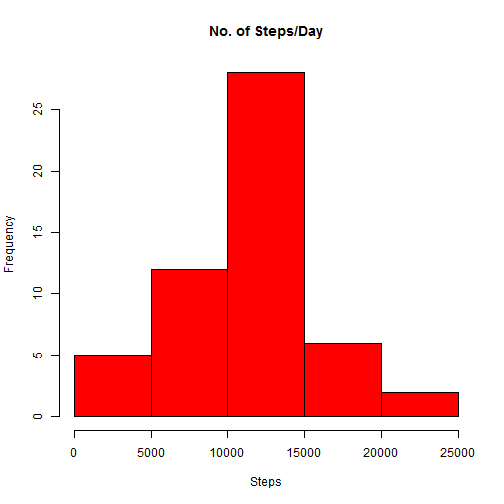
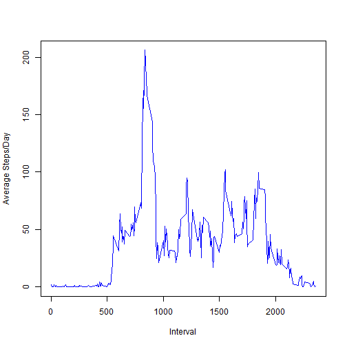
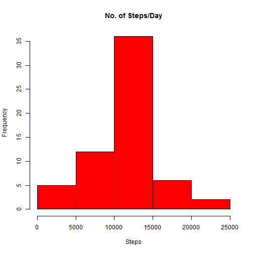
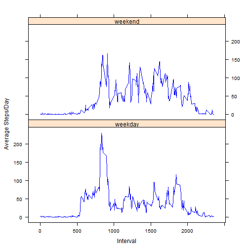

<!-- Make sure that the knitr package is installed and loaded. -->
<!-- For more info on the package options see http://yihui.name/knitr/options -->

<!-- Replace below with the title of your project -->
# Reproducible Research: Peer Assessment 1
## Loading and preprocessing the data
<!-- Enter the code required to load your data in the space below. The data will be loaded but the line of code won't show up in your write up (echo=FALSE) in order to save space-->

```r
mydata = read.csv("C:\\Users\\bimehta\\Desktop\\R_Prog\\RR\\Assignment\\activity.csv")
## Converting Date to date format
mydata$date <- as.Date(mydata$date, format = "%Y-%m-%d")
## Creating a data set that aggregates values for steps for a given day
mydata_aggr <- aggregate(steps ~ date, data = mydata, FUN = sum)
## Aggregated Sample Data
head(mydata_aggr)
```

```
##         date steps
## 1 2012-10-02   126
## 2 2012-10-03 11352
## 3 2012-10-04 12116
## 4 2012-10-05 13294
## 5 2012-10-06 15420
## 6 2012-10-07 11015
```


<!-- In the remainder of the document, add R code chunks as needed -->

## What is mean total number of steps taken per day?

```r
## Graph of Total Steps per Day
hist(mydata_aggr$steps, col = "red", xlab = "Steps", main = "No. of Steps/Day")
```

 

```r
## Calculating mean and median of total steps
m <- mean(mydata_aggr$steps)
n <- median(mydata_aggr$steps)
```

The **mean** of Total Steps is

```r
m
```

```
## [1] 10766
```

The **median** of Total Steps is

```r
n
```

```
## [1] 10765
```

## What is the average daily activity pattern?
Creating a data-set which gives the 5-minute interval and the average number of steps taken, averaged across all days. I am using aggregate() function for the same.

```r
mydata_avg <- aggregate(steps ~ interval, data = mydata, FUN = mean)
## Averaged Sample Data
head(mydata_avg)
```

```
##   interval   steps
## 1        0 1.71698
## 2        5 0.33962
## 3       10 0.13208
## 4       15 0.15094
## 5       20 0.07547
## 6       25 2.09434
```

```r
plot(mydata_avg$interval, mydata_avg$steps, type = "l", col = "blue", xlab = "Interval", 
    ylab = "Average Steps/Day")
```

 

5-minute interval that contains the maximum number of steps on average across all the days in the dataset

```r
## Finding the row number at which the maximum value of step occurs
s <- which.max(mydata_avg$steps)
## Storing thhe row at which maximum occurs
r <- mydata_avg[s, ]
```

**Interval at which maximum value occurs**

```r
r[, 1]
```

```
## [1] 835
```

**Maximum Value**


```r
r[, 2]
```

```
## [1] 206.2
```

## Imputing missing values

Calculate and report the total number of missing values in the dataset

```r
mydata_na <- subset(mydata, is.na(steps))
tail(mydata_na)
```

```
##       steps       date interval
## 17563    NA 2012-11-30     2330
## 17564    NA 2012-11-30     2335
## 17565    NA 2012-11-30     2340
## 17566    NA 2012-11-30     2345
## 17567    NA 2012-11-30     2350
## 17568    NA 2012-11-30     2355
```

Counting number of rows having missing values

```r
nrow(mydata_na)
```

```
## [1] 2304
```

Strategy for filling in all of the missing values in the dataset.

1.Find the maximum interval

2.For all intervals between 0 and maximum find mean of each interval

3.Replace NA of that interval with the mean of that interval

```r
## Finding maximum interval
z <- max(mydata$interval)
for (i in 0:z) {
    mydata_i <- subset(mydata, interval == i)
    mydata_i$steps[is.na(mydata_i$steps)] <- mean(mydata_i$steps, na.rm = TRUE)
    if (i == 0) {
        mydata_new <- mydata_i
    } else {
        mydata_new <- rbind(mydata_new, mydata_i)
    }
    i = i + 5
}
```

mydata_new is the new dataset with NA values replaced as per above logic.Checking the number of rows matches with original dataset or not. Also checking if new dataset has any missing values

```r
nrow(mydata_new)
```

```
## [1] 17568
```

```r
nrow(subset(mydata_new, is.na(steps)))
```

```
## [1] 0
```

New Histogram for Total Steps/Day with NA replaced

```r
## Creating a data set that aggregates values for steps for a given day
mydata_aggr_new <- aggregate(steps ~ date, data = mydata_new, FUN = sum)
hist(mydata_aggr_new$steps, col = "red", xlab = "Steps", main = "No. of Steps/Day")
```

 

Calculating mean and median of total steps with NA replaced

The **new mean** of Total Steps is


```r
m <- mean(mydata_aggr_new$steps)
m
```

```
## [1] 10766
```

The **new median** of Total Steps is

```r
n <- median(mydata_aggr_new$steps)
n
```

```
## [1] 10766
```

The effect of missing values is not too much on the mean as our logic used mean to populate missing values, however the median has increased by 1 point.

## Are there differences in activity patterns between weekdays and weekends?
Checking if a particular date is Saturda/Sunday (weekend) or some other day and creating a variable called day_type.
After populating the values we convert the variable to a factor variable with 2 levels.

```r
mydata_new$day_type <- weekdays(mydata_new$date)
t <- nrow(mydata_new)
for (i in 1:t) {
    if (weekdays(mydata_new[i, ]$date) %in% c("Saturday", "Sunday")) {
        mydata_new[i, ]$day_type = "weekend"
    } else {
        mydata_new[i, ]$day_type = "weekday"
    }
}
mydata_new$day_type <- factor(mydata_new$day_type, labels = c("weekday", "weekend"))
```

Creating the plot of the 5-minute interval (x-axis) and the average number of steps taken, averaged across all weekday days or weekend days (y-axis).

```r
mydata_avg_new <- aggregate(steps ~ interval + day_type, data = mydata_new, 
    FUN = mean)
## Averaged Sample Data NEW
head(mydata_avg_new)
```

```
##   interval day_type   steps
## 1        0  weekday 2.25115
## 2        5  weekday 0.44528
## 3       10  weekday 0.17317
## 4       15  weekday 0.19790
## 5       20  weekday 0.09895
## 6       25  weekday 1.59036
```

```r
library(lattice)
xyplot(steps ~ interval | day_type, data = mydata_avg_new, type = "l", col = "blue", 
    xlab = "Interval", ylab = "Average Steps/Day", layout = c(1, 2))
```

 

From the above graph we see that during the weekend the number of steps vary almost constantly between 100-150 throghout the day. However during the weekdays the highest number of average steps are around 900th interval which is probably around late morning.
Hence there is some considerable difference in the average number of steps during weekend as compared to weekdays.
### END OF DOCUMENT


